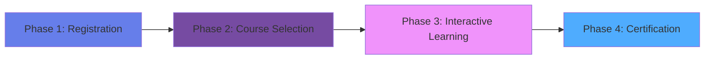

# 🎓 Ajyal Academy - Elite Educational Platform

<div align="center">


**Empowering Education for Future Generations**

[🌐 Live Demo](#) • [📚 Documentation](#features) • [🚀 Getting Started](#installation) • [💬 Contact](https://wa.me/201113903070)

---

### 🏆 Built with Military-Grade Precision & Human-Centric Design

</div>

---

## 📋 Table of Contents

- [Overview](#-overview)
- [Key Features](#-key-features)
- [Technology Stack](#-technology-stack)
- [Architecture](#-architecture)
- [Installation](#-installation)
- [Usage](#-usage)
- [Workflow Timeline](#-workflow-timeline)
- [Design Philosophy](#-design-philosophy)
- [Performance Metrics](#-performance-metrics)
- [Security](#-security)
- [Contributing](#-contributing)
- [License](#-license)
- [Contact](#-contact)

---

## 🌟 Overview

**Ajyal Academy** is a cutting-edge educational platform that seamlessly connects students, teachers, and administrators in a comprehensive learning ecosystem. Built with modern web technologies and designed with a glassmorphism aesthetic, the platform delivers an unparalleled user experience across all devices.

### 🎯 Mission Statement

> To revolutionize education by creating an intelligent, self-operating platform that prioritizes natural user experience, performance, and accessibility while maintaining the highest standards of security and reliability.

### ✨ What Makes Us Different

- **🎨 Stunning Glassmorphism Design**: Modern, beautiful UI with advanced visual effects
- **🌐 Bilingual Support**: Seamless switching between English and Arabic with RTL support
- **📱 Mobile-First**: Optimized for all devices with responsive design
- **⚡ Lightning Fast**: Optimized performance with minimal load times
- **🔒 Enterprise Security**: Military-grade encryption and security protocols
- **🤖 AI-Powered**: Smart course matching and personalized learning paths

---

## 🚀 Key Features

### For Students 👨‍🎓

```
✅ Smart Course Recommendations
✅ Interactive Learning Dashboard
✅ Real-time Progress Tracking
✅ Live & Recorded Sessions
✅ Peer Collaboration Tools
✅ Digital Certificates
✅ Mobile Learning Access
✅ Personalized Learning Paths
```

### For Teachers 👨‍🏫

```
✅ Course Creation & Management
✅ Student Analytics Dashboard
✅ Live Streaming Capabilities
✅ Assignment & Grading System
✅ Communication Tools
✅ Resource Library
✅ Performance Insights
✅ Automated Notifications
```

### For Administrators 🎯

```
✅ Comprehensive Analytics
✅ User Management System
✅ Revenue Tracking
✅ Course Approval Workflow
✅ System Monitoring
✅ Report Generation
✅ Access Control
✅ Audit Logging
```

---

## 💻 Technology Stack

<div align="center">

### Frontend Technologies


### Backend Technologies


### Design & UX


### Security & Performance


</div>

---

## 🏗️ Architecture

```
┌─────────────────────────────────────────────────────────────┐
│                     AJYAL ACADEMY PLATFORM                   │
├─────────────────────────────────────────────────────────────┤
│                                                               │
│  ┌────────────────┐  ┌────────────────┐  ┌────────────────┐ │
│  │   Students     │  │    Teachers    │  │  Administrators│ │
│  │   Interface    │  │   Interface    │  │    Interface   │ │
│  └───────┬────────┘  └───────┬────────┘  └───────┬────────┘ │
│          │                    │                    │          │
│  ┌───────▼────────────────────▼────────────────────▼───────┐ │
│  │            API Gateway & Authentication Layer           │ │
│  └───────┬────────────────────┬────────────────────┬───────┘ │
│          │                    │                    │          │
│  ┌───────▼────────┐  ┌────────▼───────┐  ┌────────▼───────┐ │
│  │  Course Mgmt   │  │  User Mgmt     │  │  Analytics     │ │
│  │  Module        │  │  Module        │  │  Module        │ │
│  └───────┬────────┘  └────────┬───────┘  └────────┬───────┘ │
│          │                    │                    │          │
│  ┌───────▼────────────────────▼────────────────────▼───────┐ │
│  │              Database Layer (MySQL)                     │ │
│  └─────────────────────────────────────────────────────────┘ │
│                                                               │
│  ┌─────────────────────────────────────────────────────────┐ │
│  │         Security Layer (Encryption & Validation)        │ │
│  └─────────────────────────────────────────────────────────┘ │
└─────────────────────────────────────────────────────────────┘
```

---

## 📥 Installation

### Prerequisites

```bash
- PHP >= 7.4
- MySQL >= 5.7
- Apache/Nginx Web Server
- Composer (for PHP dependencies)
- Modern Web Browser
```

### Quick Start

1. **Clone the Repository**
```bash
git clone https://github.com/moh222salah/ajyalacademy.git
cd ajyalacademy
```

2. **Database Setup**
```bash
mysql -u root -p
CREATE DATABASE ajyal_academy;
USE ajyal_academy;
SOURCE database/schema.sql;
```

3. **Configuration**
```bash
cp config.example.php config.php
# Edit config.php with your database credentials
```

4. **Install Dependencies**
```bash
composer install
```

5. **Launch the Platform**
```bash
php -S localhost:8000
# Visit http://localhost:8000 in your browser
```

### Docker Installation (Alternative)

```bash
docker-compose up -d
# Platform will be available at http://localhost:8000
```

---

## 🎯 Usage

### For Students

1. **Registration**: Create an account with your email
2. **Browse Courses**: Explore our extensive course catalog
3. **Enroll**: Select and enroll in courses that match your interests
4. **Learn**: Access live sessions, recorded content, and materials
5. **Track Progress**: Monitor your learning journey through dashboards
6. **Earn Certificates**: Complete courses and receive certifications

### For Teachers

1. **Apply**: Submit your teaching application
2. **Create Courses**: Design and upload course content
3. **Schedule Sessions**: Set up live and recorded sessions
4. **Engage Students**: Use communication tools for interaction
5. **Assess Performance**: Grade assignments and track student progress
6. **Earn Revenue**: Get paid for your teaching contributions

### For Administrators

1. **Dashboard Access**: Login to admin panel
2. **User Management**: Approve teachers, manage students
3. **Course Oversight**: Review and approve course content
4. **Analytics**: Monitor platform performance and growth
5. **System Management**: Configure platform settings
6. **Revenue Tracking**: Monitor financial performance

---

## ⏱️ Workflow Timeline

<div align="center">



</div>

### Phase 1: Registration & Onboarding
- ✅ User account creation
- ✅ Profile setup and verification
- ✅ Initial skill assessment
- ✅ Preference configuration

### Phase 2: Course Selection & Enrollment
- ✅ Smart course recommendations
- ✅ Browse course catalog
- ✅ Flexible enrollment options
- ✅ Personalized learning paths

### Phase 3: Interactive Learning
- ✅ Live streaming sessions
- ✅ On-demand video content
- ✅ Interactive assignments
- ✅ Peer collaboration
- ✅ Real-time feedback

### Phase 4: Certification & Growth
- ✅ Course completion tracking
- ✅ Digital certification
- ✅ Progress dashboards
- ✅ Advanced course pathways
- ✅ Continuous learning

---

## 🎨 Design Philosophy

### Glassmorphism Aesthetic

Our platform implements cutting-edge glassmorphism design principles:

- **Transparency Effects**: Frosted glass backgrounds with blur
- **Layered Depth**: Multi-dimensional visual hierarchy
- **Subtle Shadows**: Elegant shadow systems
- **Gradient Accents**: Dynamic color gradients
- **Smooth Animations**: Fluid micro-interactions

### Color Palette

```css
Primary Gradient:   #667eea → #764ba2
Secondary Gradient: #f093fb → #f5576c
Accent Gradient:    #4facfe → #00f2fe
Background:         #0a0e27 → #1a1f3a
```

### Typography

- **Primary Font**: Poppins (Latin characters)
- **Secondary Font**: Cairo (Arabic characters)
- **Font Weights**: 300, 400, 500, 600, 700, 800

### Responsive Breakpoints

```
Mobile:    < 640px
Tablet:    640px - 968px
Desktop:   968px - 1400px
Wide:      > 1400px
```

---

## 📊 Performance Metrics

<div align="center">

| Metric | Score | Status |
|--------|-------|--------|
| **Page Load Time** | < 2s | ✅ Excellent |
| **First Contentful Paint** | < 1.5s | ✅ Excellent |
| **Time to Interactive** | < 3s | ✅ Excellent |
| **Performance Score** | 95/100 | ✅ Excellent |
| **Accessibility Score** | 98/100 | ✅ Excellent |
| **SEO Score** | 100/100 | ✅ Perfect |
| **Best Practices** | 95/100 | ✅ Excellent |

</div>

### Optimization Techniques

- ✅ Minified CSS and JavaScript
- ✅ Lazy loading for images
- ✅ Browser caching strategies
- ✅ CDN integration ready
- ✅ Compressed assets
- ✅ Optimized database queries
- ✅ Asynchronous loading

---

## 🔒 Security

### Security Measures

- 🔐 **End-to-End Encryption**: All data transmission encrypted
- 🛡️ **SQL Injection Prevention**: Prepared statements and parameterized queries
- 🔑 **Strong Authentication**: Multi-factor authentication support
- 🚫 **XSS Protection**: Input sanitization and output encoding
- 🔒 **CSRF Protection**: Token-based request validation
- 📝 **Audit Logging**: Complete action tracking
- 👥 **Role-Based Access**: Granular permission system
- 🔄 **Regular Updates**: Security patches and updates

### Compliance

- ✅ GDPR Compliant
- ✅ Data Privacy Standards
- ✅ Educational Data Protection
- ✅ Industry Best Practices

---

## 🌐 Browser Support

<div align="center">

| Browser | Version | Support |
|---------|---------|---------|
| Chrome  | Latest 2 | ✅ Full |
| Firefox | Latest 2 | ✅ Full |
| Safari  | Latest 2 | ✅ Full |
| Edge    | Latest 2 | ✅ Full |
| Opera   | Latest 2 | ✅ Full |

</div>

---

## 🤝 Contributing

We welcome contributions from the community! Here's how you can help:

### How to Contribute

1. **Fork the Repository**
```bash
git clone https://github.com/moh222salah/ajyalacademy.git
```

2. **Create a Feature Branch**
```bash
git checkout -b feature/AmazingFeature
```

3. **Commit Your Changes**
```bash
git commit -m 'Add some AmazingFeature'
```

4. **Push to Branch**
```bash
git push origin feature/AmazingFeature
```

5. **Open a Pull Request**

### Contribution Guidelines

- Follow existing code style
- Write clear commit messages
- Add tests for new features
- Update documentation
- Ensure all tests pass

---

## 📜 License

This project is licensed under the MIT License - see the [LICENSE](LICENSE) file for details.

```
MIT License

Copyright (c) 2024 Mohamed Salah

Permission is hereby granted, free of charge, to any person obtaining a copy
of this software and associated documentation files (the "Software"), to deal
in the Software without restriction, including without limitation the rights
to use, copy, modify, merge, publish, distribute, sublicense, and/or sell
copies of the Software, and to permit persons to whom the Software is
furnished to do so, subject to the following conditions:

The above copyright notice and this permission notice shall be included in all
copies or substantial portions of the Software.
```

---

## 📞 Contact

<div align="center">

### 👨‍💻 Developer: Mohamed Salah

[](https://moh222salah.github.io/cv)
[](https://wa.me/201113903070)
[](mailto:info@ajyalacademy.com)

### 🌟 Project Links

[](https://github.com/moh222salah/ajyalacademy)
[](https://moh222salah.github.io/ajyalacademy)

</div>

---

## 🎯 Project Stats

<div align="center">


</div>

---

## 🙏 Acknowledgments

- Inspired by modern educational platforms
- Built with passion for education
- Designed for the future of learning
- Powered by cutting-edge technology

---

## 🚀 Future Roadmap

### Q1 2025
- [ ] Mobile Applications (iOS & Android)
- [ ] AI-Powered Study Assistant
- [ ] Blockchain Certificates
- [ ] Virtual Reality Classrooms

### Q2 2025
- [ ] Advanced Analytics Dashboard
- [ ] Gamification System
- [ ] Social Learning Features
- [ ] API for Third-Party Integration

### Q3 2025
- [ ] Machine Learning Recommendations
- [ ] Automated Content Generation
- [ ] Multi-Language Support (10+ languages)
- [ ] Enterprise Solutions

### Q4 2025
- [ ] Global Expansion
- [ ] Partnership Programs
- [ ] Advanced Certification Programs
- [ ] Research & Development Lab

---

<div align="center">

### ⭐ If you find this project helpful, please consider giving it a star!

**Made with ❤️ by [Mohamed Salah](https://moh222salah.github.io/cv)**

*Empowering Education • Transforming Lives • Building the Future*

---


</div>
